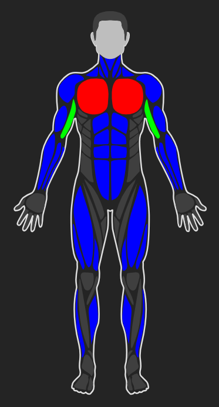
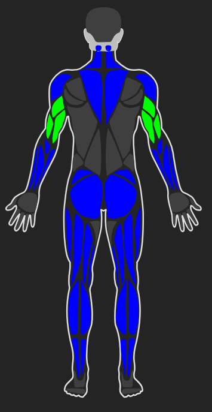
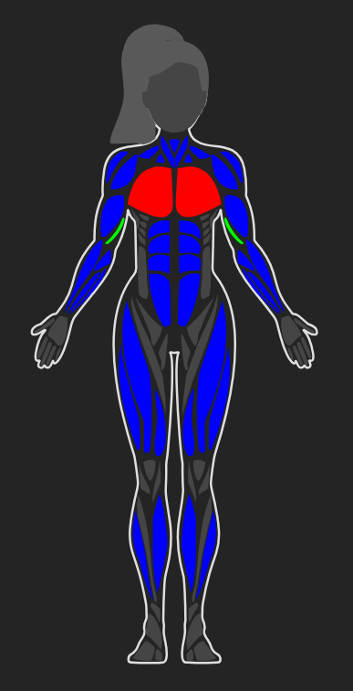

# React Human Muscles 🏋️

A beautiful, interactive React component for displaying human body anatomy with customizable muscle groups. Perfect for fitness apps, medical applications, workout trackers, and health monitoring tools.


## ✨ Features

- 🎨 **Interactive Body Visualization** - Click on body parts to interact with them
- 👥 **Male & Female Support** - Separate anatomically accurate models for both genders
- 🎯 **Front & Back Views** - Display both front and back views of the body
- 🎨 **Customizable Colors** - Style individual muscle groups with custom colors
- 📊 **Intensity Levels** - Visualize workout intensity or pain levels with color gradients
- 🎛️ **Fully Customizable** - Control borders, strokes, fills, and more
- ♿ **Accessibility** - Built with ARIA labels and keyboard navigation support
- 📱 **Responsive** - Scales beautifully on any device
- 🔧 **TypeScript** - Fully typed for better developer experience
- ⚡ **Lightweight** - Zero dependencies (except React)

## 📦 Installation

```bash
npm install react-muscle-highlighter
# or
yarn add react-muscle-highlighter
# or
pnpm add react-muscle-highlighter
```

## 🚀 Quick Start

```tsx
import Body, { type ExtendedBodyPart } from "react-muscle-highlighter";

function App() {
  const bodyData: readonly ExtendedBodyPart[] = [
    { slug: "chest", color: "#ff0000", intensity: 1 },
    { slug: "triceps", color: "#00ff00", intensity: 2 },
    { slug: "abs", color: "#0000ff" },
  ] as const;

  return (
    <Body
      data={bodyData}
      side="front"
      gender="male"
      scale={1.5}
      onBodyPartPress={(part) => console.log("Clicked:", part.slug)}
    />
  );
}
```

## 📸 Examples

### Male Body - Front View



### Male Body - Back View



### Female Body - Front View



### Female Body - Back View


## 📚 API Documentation

### Component: `Body`

The main component that renders the interactive body visualization.

#### Props

| Prop                 | Type                                                         | Default                  | Description                                          |
| -------------------- | ------------------------------------------------------------ | ------------------------ | ---------------------------------------------------- |
| `data`               | `ReadonlyArray<ExtendedBodyPart>`                            | **Required**             | Array of body parts to highlight/stylize             |
| `side`               | `"front" \| "back"`                                          | `"front"`                | Which side of the body to display                    |
| `gender`             | `"male" \| "female"`                                         | `"male"`                 | Gender of the body model                             |
| `scale`              | `number`                                                     | `1`                      | Scale factor for the body size                       |
| `colors`             | `ReadonlyArray<string>`                                      | `["#0984e3", "#74b9ff"]` | Color gradient array for intensity levels            |
| `onBodyPartPress`    | `(part: ExtendedBodyPart, side?: "left" \| "right") => void` | `undefined`              | Callback when a body part is clicked                 |
| `border`             | `string \| "none"`                                           | `"#dfdfdf"`              | Border color for body outline (use `"none"` to hide) |
| `disabledParts`      | `Slug[]`                                                     | `[]`                     | Array of body part slugs that should be disabled     |
| `hiddenParts`        | `Slug[]`                                                     | `[]`                     | Array of body part slugs that should be hidden       |
| `defaultFill`        | `string`                                                     | `"#3f3f3f"`              | Default fill color for unhighlighted body parts      |
| `defaultStroke`      | `string`                                                     | `"none"`                 | Default stroke color for body parts                  |
| `defaultStrokeWidth` | `number`                                                     | `0`                      | Default stroke width for body parts                  |

### Types

#### `ExtendedBodyPart`

Represents a body part with styling and interaction options.

```typescript
interface ExtendedBodyPart {
  slug?: Slug; // Body part identifier
  color?: string; // Color to fill the body part
  intensity?: number; // Intensity level (1-based index into colors array)
  side?: "left" | "right"; // Specific side to highlight (optional)
  styles?: BodyPartStyles; // Per-part style overrides
}
```

#### `BodyPartStyles`

Custom styles for individual body parts.

```typescript
interface BodyPartStyles {
  fill?: string; // Fill color
  stroke?: string; // Stroke color
  strokeWidth?: number; // Stroke width
}
```

#### `Slug`

Available body part identifiers.

```typescript
type Slug =
  | "abs" // Abdominal muscles
  | "adductors" // Inner thigh muscles
  | "ankles" // Ankle joints
  | "biceps" // Biceps brachii
  | "calves" // Calf muscles
  | "chest" // Pectoral muscles
  | "deltoids" // Shoulder muscles
  | "feet" // Feet
  | "forearm" // Forearm muscles
  | "gluteal" // Gluteal muscles
  | "hamstring" // Hamstring muscles
  | "hands" // Hands
  | "hair" // Hair (back view)
  | "head" // Head
  | "knees" // Knee joints
  | "lower-back" // Lower back muscles
  | "neck" // Neck
  | "obliques" // Oblique muscles
  | "quadriceps" // Quadriceps muscles
  | "tibialis" // Tibialis anterior
  | "trapezius" // Trapezius muscle
  | "triceps" // Triceps brachii
  | "upper-back"; // Upper back muscles
```

## 💡 Usage Examples

### Basic Usage

```tsx
import Body, { type ExtendedBodyPart } from "react-muscle-highlighter";

const bodyData: readonly ExtendedBodyPart[] = [
  { slug: "chest", color: "#ff0000" },
  { slug: "biceps", color: "#00ff00" },
];

<Body data={bodyData} />;
```

### Using Intensity Levels

Intensity levels map to the `colors` array (1-based indexing).

```tsx
const bodyData: readonly ExtendedBodyPart[] = [
  { slug: "chest", intensity: 1 }, // Uses colors[0]
  { slug: "biceps", intensity: 2 }, // Uses colors[1]
  { slug: "triceps", intensity: 1 }, // Uses colors[0]
];

<Body data={bodyData} colors={["#ff6b6b", "#4ecdc4", "#45b7d1"]} />;
```

### Side-Specific Highlighting

Highlight only the left or right side of a body part.

```tsx
const bodyData: readonly ExtendedBodyPart[] = [
  { slug: "biceps", color: "#ff0000", side: "left" }, // Only left bicep
  { slug: "triceps", color: "#00ff00", side: "right" }, // Only right tricep
];

<Body data={bodyData} />;
```

### Custom Styles Per Body Part

Override default styles for specific body parts.

```tsx
const bodyData: readonly ExtendedBodyPart[] = [
  {
    slug: "chest",
    color: "#ff0000",
    styles: {
      fill: "#ff0000",
      stroke: "#000000",
      strokeWidth: 2,
    },
  },
];

<Body data={bodyData} defaultFill="#3f3f3f" defaultStroke="none" />;
```

### Handling Clicks

```tsx
const handleBodyPartClick = (
  part: ExtendedBodyPart,
  side?: "left" | "right"
) => {
  console.log(`Clicked: ${part.slug}${side ? ` (${side})` : ""}`);
  // Your logic here
};

<Body data={bodyData} onBodyPartPress={handleBodyPartClick} />;
```

### Disabling Body Parts

Disabled parts appear grayed out and are not clickable.

```tsx
<Body data={bodyData} disabledParts={["chest", "biceps"]} />
```

### Hiding Body Parts

Completely hide certain body parts from rendering.

```tsx
<Body data={bodyData} hiddenParts={["hair", "head"]} />
```

### Female Body

```tsx
<Body data={bodyData} gender="female" side="front" />
```

### No Border

```tsx
<Body data={bodyData} border="none" />
```

### Custom Scale

```tsx
<Body
  data={bodyData}
  scale={2.0} // 2x larger
/>
```

### Complete Example: Workout Tracker

```tsx
import { useState } from "react";
import Body, {
  type ExtendedBodyPart,
  type Slug,
} from "react-muscle-highlighter";

function WorkoutTracker() {
  const [selectedPart, setSelectedPart] = useState<Slug | null>(null);
  const [workoutData, setWorkoutData] = useState<Record<Slug, number>>({});

  const bodyData: readonly ExtendedBodyPart[] = Object.entries(workoutData)
    .map(([slug, intensity]) => ({
      slug: slug as Slug,
      intensity: Math.min(intensity, 3), // Max intensity of 3
    }))
    .filter((part) => part.intensity > 0);

  const handlePartClick = (part: ExtendedBodyPart) => {
    setSelectedPart(part.slug || null);
    if (part.slug) {
      setWorkoutData((prev) => ({
        ...prev,
        [part.slug!]: (prev[part.slug!] || 0) + 1,
      }));
    }
  };

  return (
    <div>
      <h1>Workout Tracker</h1>
      {selectedPart && <p>Selected: {selectedPart}</p>}

      <div style={{ display: "flex", gap: "20px" }}>
        <Body
          data={bodyData}
          side="front"
          gender="male"
          colors={["#ff6b6b", "#ffa500", "#ffd700"]}
          onBodyPartPress={handlePartClick}
          scale={1.5}
        />
        <Body
          data={bodyData}
          side="back"
          gender="male"
          colors={["#ff6b6b", "#ffa500", "#ffd700"]}
          onBodyPartPress={handlePartClick}
          scale={1.5}
        />
      </div>
    </div>
  );
}
```

## 🎨 Styling

The component uses inline styles and SVG, making it easy to integrate into any design system. All colors accept any valid CSS color value (hex, rgb, rgba, hsl, named colors, etc.).

### Color Priority

When styling a body part, the following priority applies:

1. **Per-part `styles.fill`** (highest priority)
2. **`color` prop**
3. **Intensity-based color** (from `colors` array)
4. **`defaultFill`** (lowest priority)

## 🔧 Development

### Prerequisites

- Node.js 16+
- npm, yarn, or pnpm

### Building

```bash
npm run build
```

### Development

```bash
npm run dev
```

## 📝 License

MIT License - see [LICENSE](LICENSE) file for details.

## 🤝 Contributing

Contributions are welcome! Please feel free to submit a Pull Request.

## 📮 Support

If you encounter any issues or have questions, please open an issue on GitHub.

## 🙏 Acknowledgments

- Built with React and TypeScript
- SVG body illustrations for accurate anatomical representation

---

Made specially for the fitness and health community
